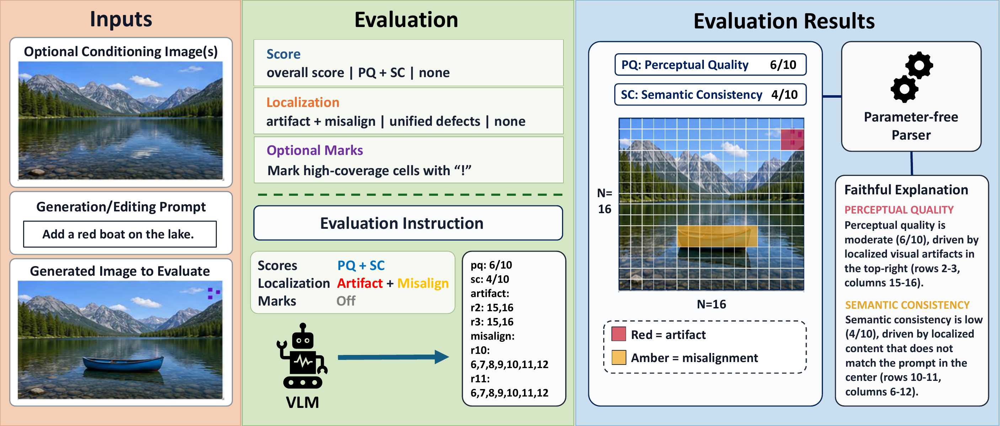
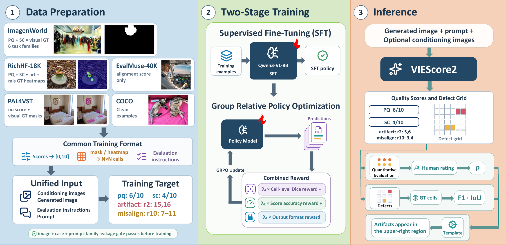

# VIEScore2

[](https://arxiv.org/abs/2610.00994)

[](https://github.com/TIGER-AI-Lab/VIEScore2/graphs/contributors)
[](https://github.com/TIGER-AI-Lab/VIEScore2/blob/main/LICENSE)
[](https://github.com/TIGER-AI-Lab/VIEScore2)

This repository hosts the code and data of our paper **VIEScore2: Unified Image Evaluation with Spatially Grounded Explanations**.

VIEScore2 is a unified evaluator for image generation and editing tasks with optional conditioning images. One fine-tuned Qwen3-VL-8B, in a single autoregressive pass, jointly emits:

- a **quality score** (dual-axis perceptual-quality `pq:` / semantic-consistency `sc:`),
- a **defect grid** localizing problematic `16×16` cells, optionally split into
  `artifact:` / `misalign:` channels with per-cell coverage marks, and
- a **faithful textual explanation** rendered deterministically from the two
  outputs above by a parameter-free parser (`viescore2/verbalize.py`).

<div align="center">

  VIEScore2 takes the generated image, the prompt and optional conditioning images, and returns scores, a defect grid and an explanation derived from them.
</div>

## 📰 News
* 2026 Sep: Code, evaluation protocol and data manifests are released!


> Training is SFT followed by GRPO with verifiable rewards: cell-level Dice + score accuracy + output-format validity.

## Repository layout

```
configs/eval_protocol.json      frozen evaluation protocol (per-source prompts/targets)
manifests/                      data manifest + dev-eval manifest (exact splits)
eval_samples/                   shipped external eval suites (AbHuman, AGIQA-3K, EvalMuse, PAL4VST)
sft_builder/                    source ingestion -> unified schema (RichHF, ImagenWorld, COCO, ...)
viescore2/
  build_sft_data.py             training-data builder (GT -> 16x16 grid rasterizer lives here)
  build_eval.py                 main evaluation-set builder
  build_*_eval.py               external benchmark converters (AbHuman, HAD, SynthScars,
                                SDG-30K, MMRB2, PAL4VST)
  train_grpo.py                 GRPO training (cell-level Dice reward)
  run_eval.py                   evaluation harness: local checkpoints or API backends
                                (--api-backend openai|gemini|anthropic), resume-safe
  merge_shards.py               merge row-sharded parallel eval runs (dedupe by id)
  eval_*.py                     baseline evaluators under their native contracts
                                (RAHF, ImageDoctor, PAL4VST, SegFormer, HADM, LEGION,
                                 SDG, FGA-BLIP2, scalar/MLLM scorers)
  analyze_*.py                  paper-table analyzers on the published bases
  bootstrap_ci.py               paired bootstrap CIs for headline claims
  dev_eval.py, leakage_gate.py  dev metrics + train/eval leakage checks
scripts/
  download_base_models.sh       base checkpoints
  train_sft.py                  SFT stage
tests/                          unit tests (protocol, rewards, sampling)
```

## Conventions

- **Naming:** `VIEScore2` denotes the full model after GRPO. Ablated variants
  are marked by what they lack — e.g. `VIEScore2 (w/o GRPO)` for the SFT-only
  stage — never by added suffixes.
- **Paths:** `$DATA_ROOT` in code, configs and manifests is a placeholder for
  your local data root; export it before running (`export DATA_ROOT=...`).

## Setup

```bash
python -m venv .venv && source .venv/bin/activate
pip install -r requirements.txt
python download_data.py          # public source datasets
bash scripts/download_base_models.sh
```

## Reproduce

1. **Build data** — `python -m sft_builder.pipeline` then
   `python viescore2/build_sft_data.py` (train) and
   `python viescore2/build_eval.py` (eval); external benchmarks via the
   corresponding `viescore2/build_*_eval.py`.
2. **Train** — SFT: `python scripts/train_sft.py`;
   GRPO: `python viescore2/train_grpo.py --kl-beta 0 --num-generations 4`.
3. **Evaluate** — ours or any HF checkpoint:
   ```bash
   python viescore2/run_eval.py --checkpoint <ckpt> --eval-data <jsonl> \
       --protocol-config configs/eval_protocol.json --output out.json
   ```
   Closed models use `--api-backend openai|gemini|anthropic --api-model <id>`
   with byte-identical prompts and parser.
4. **Analyze** — `viescore2/analyze_specialists.py`, `analyze_external.py --bench <b>`,
   `analyze_evaluators.py --bench all`, `analyze_mmrb2.py` reproduce the paper
   tables on each benchmark's published basis.

All evaluation numbers in the paper come from the frozen protocol in
`configs/eval_protocol.json`; thresholds for transferred heatmap baselines
are tuned once on the RichHF tuning slice and carried frozen everywhere.

## Citation

```bibtex
@misc{du2026viescore2unifiedimageevaluation,
      title={VIEScore2: Unified Image Evaluation with Spatially Grounded Explanations}, 
      author={Xianda Du and Max Ku and Weiming Ren and Zhi Rui Tam and Chunlin Ren and Ping Nie and Min-Hung Chen and Wenhu Chen},
      year={2026},
      eprint={2610.00994},
      archivePrefix={arXiv},
      primaryClass={cs.CV},
      url={https://arxiv.org/abs/2610.00994}, 
}
```
